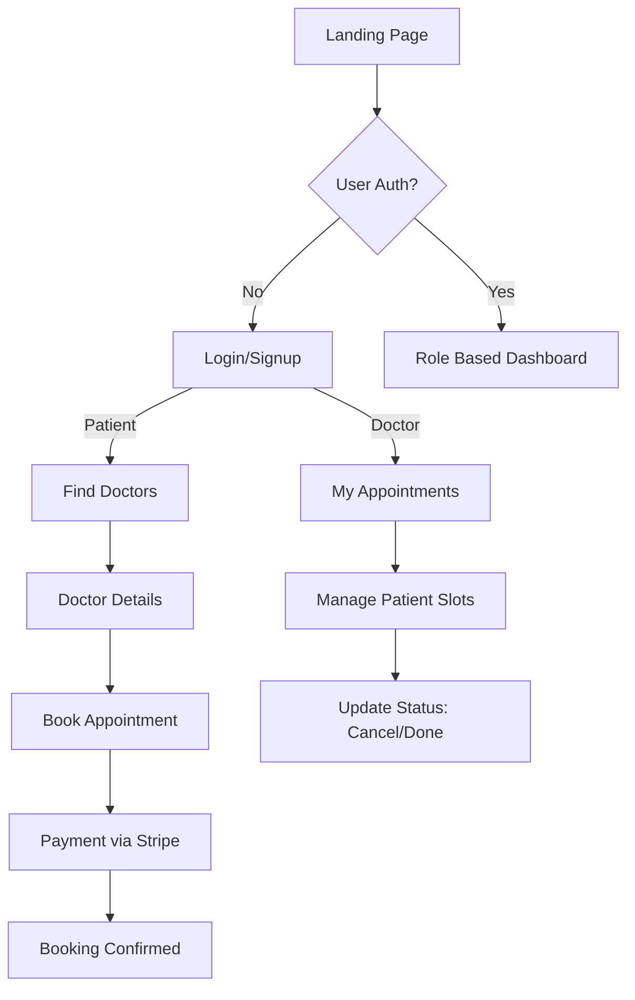
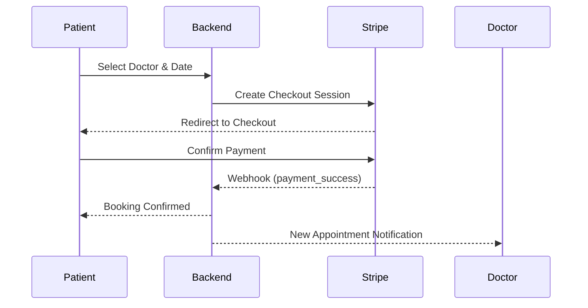
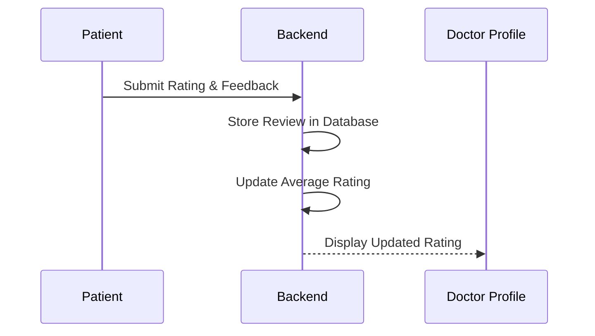

# 🏥 Medicare - Full-Stack Doctor Appointment Booking System

Medicare is a comprehensive healthcare platform built to streamline patient-doctor interactions. It provides a robust ecosystem for finding specialists, managing appointments, handling secure payments, and enabling patient feedback.

---

# 🎨 System Overview

Medicare uses a modern MERN stack architecture with role-based access control and integrated financial services via Stripe.

## 🔄 General User Flow



---

# 🚀 Detailed Tech Stack

| Layer        | Technology        | Description                               |
| ------------ | ----------------- | ----------------------------------------- |
| **Frontend** | React (Vite)      | High-performance SPA with fast HMR        |
| **Styling**  | Tailwind CSS      | Utility-first CSS for responsive UI       |
| **Backend**  | Node.js / Express | RESTful API architecture                  |
| **Database** | MongoDB           | NoSQL database with Mongoose              |
| **Security** | JWT & Bcrypt      | Token authentication and password hashing |
| **Payments** | Stripe            | Secure online payment processing          |
| **UI/UX**    | Swiper, Toastify  | Sliders and notifications                 |

---

# ✨ Key Features & Technical Depth

## 🔒 Authentication & Authorization

* **JWT Authentication:** Stateless authentication system using secure tokens.
* **Role-Based Access Control:** Middleware protects routes based on user roles (`patient`, `doctor`, `admin`).
* **Secure Password Storage:** Passwords are hashed using `bcryptjs`.
* **Protected Routes:** Only authenticated users can access dashboards and bookings.

---

## 🩺 Doctor Discovery & Booking

* Patients can browse and search doctors by **name or specialization**.
* Doctor profiles display **experience, qualifications, specialization, ratings, and reviews**.
* Appointment slots can be selected based on **date and time availability**.

### Appointment Booking Flow



---

## 💳 Financial Integration

* **Stripe Checkout Integration:** Secure payment processing for appointment bookings.
* **Stripe Webhooks:** Backend verifies successful payment before confirming appointments.
* **Payment Failure Handling:** The system gracefully handles unsuccessful transactions.
* **Refund Handling:** Appointment cancellations can trigger refund workflows.

---

## ⭐ Feedback & Rating System

Patients can provide feedback after completing appointments.

Features include:

* **Patient Reviews:** Patients can submit ratings and feedback for doctors after appointments.
* **Rating Calculation:** The system calculates the **average rating** of each doctor.
* **Doctor Reputation:** Ratings and reviews appear on doctor profiles.
* **Secure Storage:** Reviews are stored in MongoDB and linked to the doctor and patient.

### Review Submission Flow



---

## 📊 Role-Based Dashboards

### Patient Dashboard

* View appointment history
* Track booking status
* Manage personal profile
* Leave doctor reviews

### Doctor Dashboard

* View scheduled appointments
* Update appointment status
* Manage profile information
* Track patient feedback

---

# 🔌 API Overview

## Auth

| Method | Endpoint                | Description         |
| ------ | ----------------------- | ------------------- |
| POST   | `/api/v1/auth/register` | Register a new user |
| POST   | `/api/v1/auth/login`    | Authenticate user   |

---

## User (Patient)

| Method | Endpoint                                     | Description              |
| ------ | -------------------------------------------- | ------------------------ |
| GET    | `/api/v1/users/profile/me`                   | Get current user profile |
| PUT    | `/api/v1/users/:id`                          | Update user profile      |
| GET    | `/api/v1/users/appointments/my-appointments` | Get patient appointments |

---

## Booking

| Method | Endpoint                       | Description                |
| ------ | ------------------------------ | -------------------------- |
| POST   | `/api/v1/bookings`             | Create appointment booking |
| GET    | `/api/v1/bookings/my-bookings` | Fetch user bookings        |
| PUT    | `/api/v1/bookings/:id/status`  | Update booking status      |

---

## Reviews

| Method | Endpoint                      | Description          |
| ------ | ----------------------------- | -------------------- |
| POST   | `/api/v1/reviews`             | Submit doctor review |
| GET    | `/api/v1/doctors/:id/reviews` | Fetch doctor reviews |

---

# 🛠 Installation & Setup

## 1️⃣ Clone the Repository

```bash
git clone https://github.com/Arunabh-Sen/medicare-application-minor-project.git
cd medicare-application-minor-project
```

---

## 2️⃣ Install Dependencies

```bash
npm install
```

---

## 3️⃣ Configure Environment Variables

### Backend (`/backend/.env`)

```env
PORT=5000
MONGODB_URI=your_mongodb_uri
JWT_SECRET_KEY=your_secret_key
STRIPE_SECRET_KEY=your_stripe_secret
CLIENT_SITE_URL=http://localhost:5173
```

### Frontend (`/frontend/.env`)

```env
VITE_BACKEND_URL=http://localhost:5000/api/v1
VITE_STRIPE_PUBLIC_KEY=your_stripe_public_key
```

---

## 4️⃣ Run Development Servers

### Backend

```bash
cd backend
npm run dev
```

### Frontend

```bash
cd frontend
npm run dev
```

---

# 📁 Project Structure

```
medicare-application/
│
├── backend/
│   ├── Controllers/
│   ├── Models/
│   ├── Routes/
│   ├── auth/
│   └── index.js
│
├── frontend/
│   ├── src/
│   │   ├── components/
│   │   ├── pages/
│   │   ├── assets/
│   │   └── context/
│   │
│   └── tailwind.config.js
│
└── README.md
```

---

# 📝 License

Distributed under the **ISC License**.
