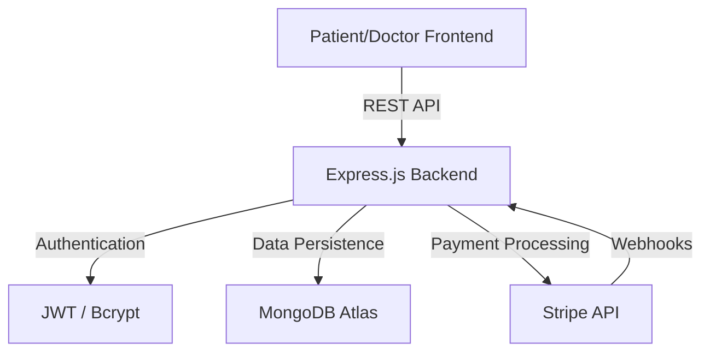
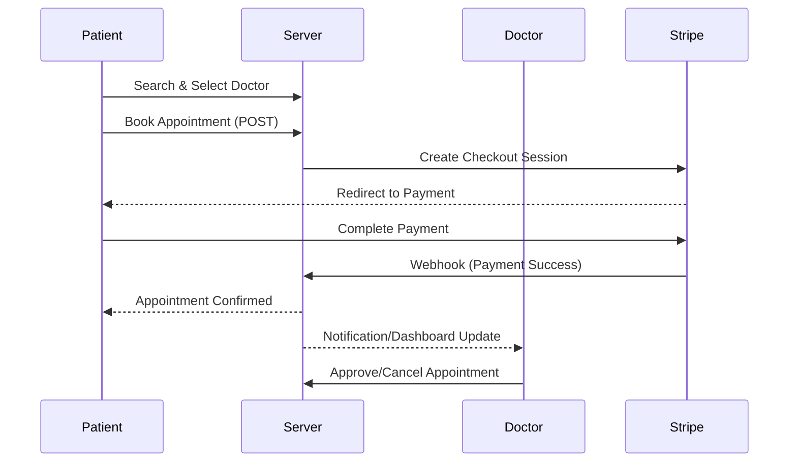

# 🏥 Medicare - Healthcare Appointment Management Platform

A modern, full-stack healthcare platform built with the **MERN stack**, designed to bridge the gap between patients and doctors. Features seamless appointment scheduling, real-time status tracking, and secure payment processing.

---

## 🚀 Features

### For Patients
- **🔍 Doctor Discovery**: Search and filter doctors by specialization and location.
- **📅 Easy Booking**: Schedule appointments with a few clicks.
- **💳 Secure Payments**: Integrated with **Stripe** for hassle-free billing.
- **📝 Reviews & Ratings**: Share feedback and view doctor reputations.
- **📊 Personal Dashboard**: Manage upcoming appointments and track health history.

### For Doctors
- **👨‍⚕️ Profile Management**: Showcase expertise, qualifications, and experience.
- **🕒 Availability Control**: Set and manage custom time slots.
- **📋 Patient Management**: View and update appointment statuses (Approve/Cancel).
- **📈 Professional Dashboard**: Overview of earnings, patient growth, and scheduled visits.

### Core Utilities
- **🔐 JWT Authentication**: Role-based access control (RBAC).
- **📧 Validation**: Real-time form validation and email uniqueness checks.
- **📱 Responsive UI**: Fully optimized for mobile, tablet, and desktop.

---

## 🛠️ Tech Stack

| Component | Technology | Description |
| :--- | :--- | :--- |
| **Frontend** | React (19.2.0), Vite | Lightning-fast UI development with HMR. |
| **Styling** | Tailwind CSS (v4) | Utility-first, modern responsive design. |
| **Backend** | Node.js, Express | Scalable and efficient RESTful API architecture. |
| **Database** | MongoDB (Mongoose) | Performance-oriented NoSQL data modeling. |
| **Payments** | Stripe API | Secure, PCI-compliant payment gateway. |
| **Auth** | JWT, Bcryptjs | Industry-standard security and password hashing. |
| **UX/UI** | Swiper, Toastify | Dynamic carousels and smooth notification systems. |

---

## ⚙️ Technical Workflow

### Architecture Overview


### Appointment Lifecycle


---

## 📡 API Endpoints (v1)

### Authentication
- `POST /api/v1/auth/register` - Create a new account (Patient/Doctor)
- `POST /api/v1/auth/login` - Authenticate and get JWT

### User (Patient)
- `GET /api/v1/users/profile/me` - Get own profile (Protected)
- `GET /api/v1/users/appointments/my-appointments` - View personal bookings
- `PUT /api/v1/users/:id` - Update profile details

### Doctor
- `GET /api/v1/doctors` - Search and list all doctors
- `GET /api/v1/doctors/:id` - Get detailed doctor profile
- `GET /api/v1/doctors/profile/me` - Get logged-in doctor stats
- `PUT /api/v1/doctors/:id` - Update professional info

### Bookings & Payments
- `POST /api/v1/bookings` - Initiate booking session (Protected)
- `GET /api/v1/bookings/my-bookings` - Fetch booking history
- `POST /api/v1/payments/checkout-session/:doctorId` - Stripe integration

---

## 📦 Installation & Setup

### 1. Prerequisites
- [Node.js](https://nodejs.org/) (v16.x or higher)
- [MongoDB Atlas](https://www.mongodb.com/cloud/atlas) account
- [Stripe](https://stripe.com/) Developer account

### 2. Backend Configuration
```bash
# Clone the repository
git clone https://github.com/Arunabh-Sen/medicare-application-minor-project.git
cd medicare_application/backend

# Install dependencies
npm install

# Create .env file and add details
PORT=5000
MONGO_URI=your_mongodb_connection_string
JWT_SECRET_KEY=your_secret_key
STRIPE_SECRET_KEY=your_stripe_key
CLIENT_SITE_URL=http://localhost:5173
```

### 3. Database Seeding (Optional)
```bash
# To populate the DB with initial doctor profiles
node seed.js
```

### 4. Frontend Configuration
```bash
cd ../frontend
npm install
npm run dev
```

---

## 📂 Project Structure

```text
├── backend
│   ├── Controllers      # API Logic
│   ├── models           # Mongoose Schemas
│   ├── Routes           # API Endpoint Definitions
│   ├── auth             # Middleware (JWT Verify)
│   └── index.js         # Entry Point
├── frontend
│   ├── src
│   │   ├── components   # Reusable UI Blocks
│   │   ├── pages        # Main Views
│   │   ├── routes       # App Navigation
│   │   └── context      # State Management
└── README.md            # You are here!
```

---

## 🤝 Contributing
Contributions are what make the open-source community such an amazing place.
1. Fork the Project
2. Create your Feature Branch (`git checkout -b feature/AmazingFeature`)
3. Commit your Changes (`git commit -m 'Add some AmazingFeature'`)
4. Push to the Branch (`git push origin feature/AmazingFeature`)
5. Open a Pull Request

## 📄 License
This project is for educational purposes. All rights reserved. 2026.
