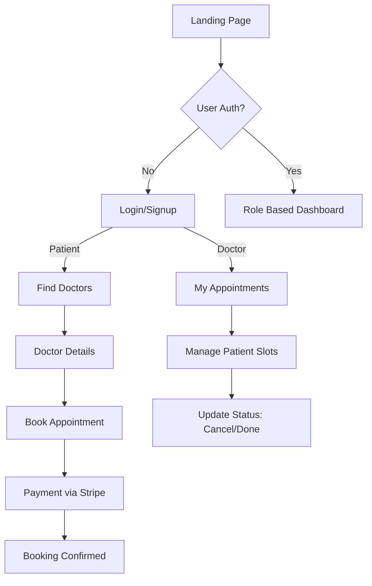

# 🏥 Medicare - Full-Stack Doctor Appointment Booking System

Medicare is a comprehensive healthcare platform built to streamline patient-doctor interactions. It provides a robust ecosystem for finding specialists, managing appointments, and handling secure payments.

---

## 🎨 System Overview

Medicare uses a modern MERN stack architecture with role-based access control and integrated financial services via Stripe.

### 🔄 General User Flow



---

## 🚀 Detailed Tech Stack

| Layer | Technology | Description |
| :--- | :--- | :--- |
| **Frontend** | React (Vite) | High-performance SPA with fast HMR. |
| **Styling** | Tailwind CSS | Utility-first CSS for a premium, responsive UI. |
| **Backend** | Node.js / Express | Scalable RESTful API architecture. |
| **Database** | MongoDB | NoSQL database with Mongoose for schema modeling. |
| **Security** | JWT & Bcrypt | Secure token-based auth and password hashing. |
| **Payments** | Stripe | Integrated checkout flow and webhook verification. |
| **UI/UX** | Swiper, Toastify | Interactive sliders and real-time notifications. |

---

## ✨ Key Features & Technical Depth

### 🔒 Authentication & Authorization
- **JWT Implementation**: Stateless authentication using secure HTTP-only cookies/tokens.
- **Route Guards**: Custom middleware `authenticate` and `restrict` to protect API endpoints based on user roles (`patient`, `doctor`, `admin`).
- **Secure Hashing**: User passwords are never stored in plain text, thanks to `bcryptjs`.

### 🩺 Doctor Discovery & Booking
- **Filtering Logic**: Patients can search by name or filter by specialty (e.g., Surgeon, Neurologist).
- **Appointment Lifecycle**:
    ```mermaid
    sequenceDiagram
        participant P as Patient
        participant B as Backend
        participant S as Stripe
        participant D as Doctor

        P->>B: Select Doctor & Date
        B->>S: Create Checkout Session
        S-->>P: Redirect to Checkout
        P->>S: Confirm Payment
        S-->>B: Webhook (payment_success)
        B-->>P: Booking Confirmed
        B-->>D: New Appointment Notification
    ```

### 💳 Financial Integration
- **Stripe Webhooks**: Ensures that appointments are only booked after successful payment confirmation, handling asynchronous payment events reliably.
- **Refund Logic**: Integrated support for handling cancellations and status updates.

### 📊 Role-Based Dashboards
- **Patient Dashboard**: Full visibility into booking history, payment status, and profile management.
- **Doctor Dashboard**: Specialized view for managing patient appointments, updating professional details, and tracking earnings.

---

## 🔌 API Overview

### Auth
| Method | Endpoint | Description |
| :--- | :--- | :--- |
| POST | `/api/v1/auth/register` | Create a new account |
| POST | `/api/v1/auth/login` | Authenticate and get token |

### User (Patient)
| Method | Endpoint | Description |
| :--- | :--- | :--- |
| GET | `/api/v1/users/profile/me` | Get current user info |
| GET | `/api/v1/users/appointments/my-appointments` | List patient bookings |
| PUT | `/api/v1/users/:id` | Update profile |

### Booking
| Method | Endpoint | Description |
| :--- | :--- | :--- |
| POST | `/api/v1/bookings` | Initiate appointment booking |
| GET | `/api/v1/bookings/my-bookings` | Fetch all bookings for user |
| PUT | `/api/v1/bookings/:id/status` | Update status (Doctor only) |

---

## 🛠️ Installation & Setup

### 1. Clone & Install
```bash
git clone https://github.com/Arunabh-Sen/medicare-application-minor-project.git
cd medicare-application-minor-project
npm install  # Root dependencies
```

### 2. Configure Environment `.env`

**Backend (`/backend/.env`)**
```env
PORT=5000
MONGODB_URI=your_mongodb_uri
JWT_SECRET_KEY=your_secret_key
STRIPE_SECRET_KEY=your_stripe_secret
CLIENT_SITE_URL=http://localhost:5173
```

**Frontend (`/frontend/.env`)**
```env
VITE_BACKEND_URL=http://localhost:5000/api/v1
VITE_STRIPE_PUBLIC_KEY=your_stripe_public_key
```

### 3. Run Development Servers
**Backend:**
```bash
cd backend && npm run dev
```
**Frontend:**
```bash
cd frontend && npm run dev
```

---

## 📁 Project Structure

```text
medicare-application/
├── backend/
│   ├── Controllers/   # Business logic for auth, user, doctor, etc.
│   ├── Models/        # Mongoose schemas for User, Doctor, Booking, Review
│   ├── Routes/        # API endpoint definitions
│   ├── auth/          # Authentication middleware (token verification)
│   └── index.js       # Main server entry point
├── frontend/
│   ├── src/
│   │   ├── components/ # Reusable UI components
│   │   ├── pages/      # Top-level page components (Dashboards, Booking, etc.)
│   │   ├── assets/     # Images, icons, and static data
│   │   └── context/    # Global state management
│   └── tailwind.config.js
└── README.md
```

---

## 📝 License
Distributed under the ISC License.
